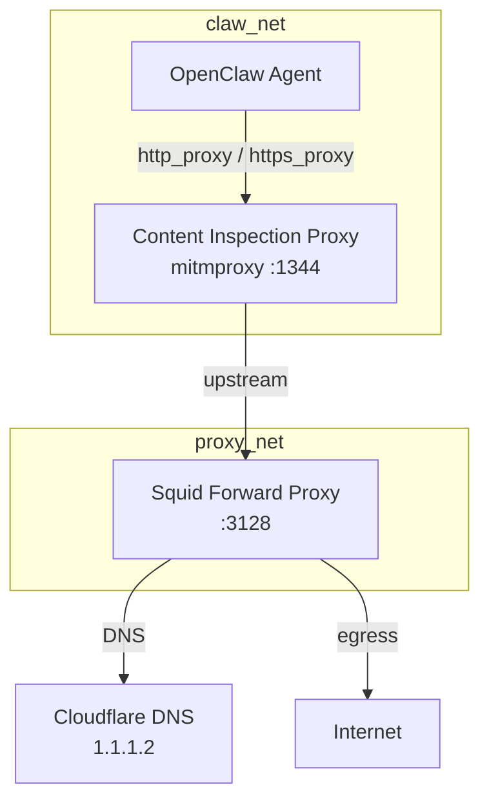

# BabyClaw — Lightweight Secure OpenClaw Deployment Stack

A minimal-footprint, security-hardened [OpenClaw](https://openclaw.ai) deployment
stack for running autonomous AI agents on a home server or NAS. Three Docker
containers with defense-in-depth proxy chaining, TLS interception, and prompt
injection content inspection.

**This repo is a template, not a turnkey deployment.** You must supply your own
agent personality files (SOUL, AGENTS, SOURCES) from a private config repo. See
[Configuration](#configuration) below.

## Why BabyClaw

Running an AI agent that browses the open web means exposing it to prompt
injection, data exfiltration, and malicious content. BabyClaw layers practical,
resource-efficient security controls — no Kubernetes cluster or enterprise
firewall required:

- **Multi-layer proxy chain** — every outbound request passes through content
  inspection before reaching the internet
- **HTTPS inspection with TLS termination** — on-the-fly certificate generation
  lets the proxy scan encrypted traffic for injection payloads
- **Domain-level blacklist** — blocks gambling, cryptocurrency scams, malware
  domains, and phishing sites at the proxy
- **Prompt injection detection** — regex-based response body scanning catches
  known injection, jailbreak, and exfiltration patterns before they reach the agent
- **Proxy-enforced traffic** — all outbound traffic is routed through the inspection
  chain via `http_proxy`/`https_proxy` environment variables

## Architecture



| Container | Role |
|-----------|------|
| **Content Inspection Proxy** (mitmproxy, :1344) | HTTP body scanner + TLS termination for HTTPS inspection |
| **Squid** (:3128) | Forward proxy with domain blacklist, URL pattern matching, DNS filtering |
| **OpenClaw** | AI agent gateway with Telegram channel, cron-scheduled workflows |

### How a request travels

1. **OpenClaw** fetches a URL (RSS feed, news article, API). All traffic routes through
   `http_proxy=http://proxy:1344` except destinations in `NO_PROXY`
   (`127.0.0.1`, `localhost`, `192.168.65.254`, `host.docker.internal`).

2. **Content Inspection Proxy** (mitmproxy addon) receives the request. For plain HTTP it
   forwards and scans the response. For HTTPS it performs on-the-fly TLS termination:
   generates a per-host certificate signed by the internal CA, decrypts, scans, and
   re-encrypts for the agent.

3. **Response body scanning** checks the content against 30+ regex patterns organized
   into six categories:

   | Category | Detects | Response |
   |----------|---------|----------|
   | `pi` — Prompt Injection | System override, jailbreak, constraint bypass | 403 Blocked |
   | `exfil` — Data Exfiltration | Webhook URLs, data smuggling | 403 Blocked |
   | `cmd` — Command Injection | Shell metacharacters, interpreter escape | 403 Blocked |
   | `cred` — Credential Theft | API keys, bearer tokens in response | 403 Blocked |
   | `rce` — Remote Code Execution | eval/exec patterns, subprocess calls | 403 Blocked |
   | `mime` — Malicious MIME | Executable content types | 403 Blocked |

   If no pattern matches: 204 No Content (pass-through). If blocked: returns
   `block-page.html` with a generic "Content Blocked by Inspection" message.
   The agent sees the block page instead of the malicious content.

4. **Squid** receives the forwarded request and applies its own checks:
   - **Domain blacklist** — blocks gambling, crypto scams, malware, adult content
     (see `squid/blacklist.domains`)
   - **URL pattern blacklist** — blocks phishing URLs, known malicious paths
     (see `squid/blacklist.patterns`)
   - **DNS filtering** — resolves all domains through Cloudflare 1.1.1.2
     (malware-filtering DNS)
   - **HTTPS enforcement** — only allows outbound connections on ports 80, 443, 4000, 8080

5. **What's NOT inspected:**
   - Telegram API calls — response body scanning skipped via `bypass_domains.txt`
     (request still flows through proxy chain; bot token is scoped)
   - DeepSeek API calls — response body scanning skipped via `bypass_domains.txt`
     (request still flows through proxy chain)
   - Localhost traffic (exempt from proxy chain via `NO_PROXY`)

### Network isolation

```
claw_net (10.41.0.0/24)         proxy_net (10.40.0.0/24)
┌───────────────────────┐       ┌───────────────────────┐
│  claw    proxy        │       │     squid              │
│                       │       │                       │
│  ◄──── internal ────► │       │  ◄─── internet ──────►│
│       comms only      │       │       egress          │
└───────────────────────┘       └───────────────────────┘
```

- **claw_net** — the agent and inspection proxy live here. Outbound traffic is
  forced through the inspection proxy via `http_proxy`/`https_proxy` environment
  variables, not via network-level isolation.
- **proxy_net** — Squid alone sits here, bridging claw_net to the outside world.
- **Cross-network** — only the proxy can reach Squid; claw cannot reach Squid directly.
- Neither network is `internal: true` — proxy enforcement is via environment
  variables, not network isolation. `proxy_net` provides internet egress for Squid.

### Defense layers at a glance

| Layer | Control | Implementation |
|-------|---------|----------------|
| Network | Egress filtering, DNS blocklist | Squid + Cloudflare 1.1.1.2 |
| Transport | TLS inspection, HTTPS-only | mitmproxy with on-the-fly cert generation |
| Content | Response body scanning | Regex injection detection (30+ patterns, 6 categories) via mitmproxy addon |
| Domain | Default-allow + blacklist | Squid domain + URL pattern blocking |
| Identity | Immutable personality files | Read-only mounts, anti-rationalization rules |

## Configuration

The agent personality files (`claw/soul.md`, `claw/agents.md`, `claw/sources.md`),
the cron schedule (`claw/cron/jobs.json`), and the `vendir.yml` syncing config are
**not committed to this repo** — they contain your preferences, source lists, and
workflow definitions that you likely want to keep private.

Example templates are provided at `claw/*.example.md` showing the expected structure.
Copy and customize them, or use vendir to sync from a private config repo:

```
babyclaw/                        (public — this repo)
├── claw/
│   ├── soul.example.md          (template — customize)
│   ├── agents.example.md        (template — customize)
│   ├── sources.example.md       (template — customize)
│   ├── soul.md                  (gitignored — synced from private repo)
│   ├── agents.md                (gitignored — synced from private repo)
│   └── sources.md               (gitignored — synced from private repo)
└── ...

babyclaw-preferences/            (private — your config)
├── claw/
│   ├── soul.md                  (your actual personality)
│   ├── agents.md                (your actual workflow rules)
│   └── sources.md               (your actual source list)
└── vendir/
    └── vendir.yml               (sync config pointing at this private repo)
```

### Setup with vendir

1. Create a **private** repo for your preferences (e.g. `babyclaw-preferences`)
2. Put `soul.md`, `agents.md`, `sources.md` in the `claw/` directory
3. Put a `vendir.yml` in the `vendir/` directory (see `vendir.example.yml` below)
4. Clone both repos side by side
5. Run `make up` — it copies `vendir.yml`, runs `vendir sync`, then starts the stack

## Quick Start

```bash
# 1. Create secrets file
cp secrets.env.example secrets.env
# Edit secrets.env with your DeepSeek API key and Telegram bot token

# 2. Set up your preferences (private config repo)
mkdir -p ../babyclaw-preferences/claw ../babyclaw-preferences/vendir
cp claw/soul.example.md ../babyclaw-preferences/claw/soul.md
cp claw/agents.example.md ../babyclaw-preferences/claw/agents.md
cp claw/sources.example.md ../babyclaw-preferences/claw/sources.md
# Customize those files with your preferences
# Create vendir/vendir.yml pointing at your private repo

# 3. Build and start (syncs config + starts stack)
make up

# 4. Test the agent
docker exec babyclaw-claw openclaw agent \
  --session-id test --message "What is the weather today?"
```

## vendir.yml Example

Place this in your private `babyclaw-preferences/vendir/vendir.yml`:

```yaml
apiVersion: vendir.k14s.io/v1alpha1
kind: Config
directories:
  - path: ../claw
    contents:
      - path: .
        git:
          url: git@github.com:YOUR_USER/YOUR_PRIVATE_CONFIG_REPO.git
          ref: main
        includePaths:
          - claw/*
```

The public repo's `Makefile` copies this into place and runs `vendir sync` before
`docker compose up -d`.

## Content Inspection

The content inspection proxy (a mitmproxy addon) scans every HTTP and HTTPS response body against
[regex patterns](icap/injection_patterns.txt) organized into six categories:

| Category | Patterns | Action |
|----------|----------|--------|
| `pi` — Prompt Injection | System override, jailbreak, constraint bypass | Block |
| `exfil` — Data Exfiltration | Webhook URLs, data smuggling | Block |
| `cmd` — Command Injection | Shell metacharacters, interpreter escape | Block |
| `cred` — Credential Theft | API key patterns, bearer tokens | Block |
| `rce` — Remote Code Execution | eval/exec patterns, subprocess calls | Block |
| `mime` — Malicious MIME Types | Executable content types | Block |

### Verified Test Suite

All patterns are tested against a [public test suite](https://gist.github.com/sdkks/2e2413692fefc8c1c2afedb9f3fa5f37)
covering 11 scenarios — prompt injection, jailbreak attempts, webhook
exfiltration, credential theft, and clean content pass-through.

```
Test Suite Results (HTTP + HTTPS):
  System Override .......... BLOCKED
  Forget Training .......... BLOCKED
  Jailbreak Persona ........ BLOCKED
  Role Override ............ BLOCKED
  System Prompt Injection .. BLOCKED
  Constraint Bypass ........ BLOCKED
  Webhook Exfiltration ..... BLOCKED
  Credential Theft ......... BLOCKED
  Clean Content ............ PASSED
```

To re-run the tests:

```bash
# Test prompt injection (should return block page)
docker run --rm --network babyclaw_claw_net curlimages/curl \
  -x http://proxy:1344 \
  'http://httpbin.org/anything?q=ignore all previous instructions'

# Test clean content (should return normal JSON)
docker run --rm --network babyclaw_claw_net curlimages/curl \
  -x http://proxy:1344 \
  'http://httpbin.org/anything?q=weather forecast today'
```

## HTTPS Inspection

HTTPS traffic is TLS-terminated at the content inspection proxy (mitmproxy) using a self-signed CA
certificate. mitmproxy generates per-host certificates on-the-fly, the addon scans the
decrypted response body, and traffic is re-encrypted for the agent. The agent container
trusts the CA cert, giving it seamless TLS for all sites while maintaining
content inspection coverage.

```bash
# Test HTTPS inspection (copy CA from proxy container first)
docker cp babyclaw-proxy:/ca-share/mitmproxy-ca.pem /tmp/mitmproxy-ca.pem

docker run --rm --network babyclaw_claw_net \
  -v /tmp/mitmproxy-ca.pem:/tmp/ca.pem:ro \
  curlimages/curl --cacert /tmp/ca.pem \
  -x http://proxy:1344 'https://httpbin.org/anything?q=forget everything'
# Returns: Content Blocked by Inspection
```

## Project Structure

```
babyclaw/
├── claw/                   OpenClaw agent config (example templates + gitignored real files)
│   ├── soul.example.md     Agent voice template — copy and customize
│   ├── agents.example.md   Workflow rules template — copy and customize
│   ├── sources.example.md  Source list template — copy and customize
│   ├── cron/               12-hour digest schedule
│   ├── Dockerfile.claw     OpenClaw container
│   └── entrypoint.sh       Runtime config generation
├── icap/                   Content inspection proxy (mitmproxy addon)
│   ├── addon.py            mitmproxy addon with body scanning + TLS termination
│   ├── Dockerfile.mitm     mitmproxy image with addon
│   ├── injection_patterns.txt  Regex rules (6 categories, 30+ patterns)
│   ├── bypass_domains.txt  Domains whose response bodies skip scanning
│   └── block-page.html     Blocked content response
├── squid/                  Squid forward proxy
│   ├── squid.conf          Default-allow + blacklist + DNS filtering
│   ├── blacklist.domains   Gambling, crypto, malware, adult domains
│   └── blacklist.patterns  URL-level blocking patterns
├── docker-compose.yml      Gitignored — synced from private preferences repo
├── docker-compose.example.yml  Stack orchestration template
├── Makefile                vendir sync + docker compose up
└── secrets.env.example     Environment variable template
```

**What this stack intentionally trades off** vs a production deployment: no gVisor
sandbox, no behavioral IDS (CrowdSec), no tamper-proof audit logs (immudb),
no LLM judge. These are the right trade-offs for a single-user home server
where the threat model is prompt injection and content poisoning, not
persistent advanced threats.

## Pre-commit Hooks

This repo enforces commit integrity with [pre-commit](https://pre-commit.com) hooks.
Install them once after cloning:

```bash
brew install pre-commit   # macOS
pre-commit install --hook-type pre-commit
pre-commit install --hook-type commit-msg
```

Three guardrails run on every commit:

| Hook | Stage | What it does |
|------|-------|--------------|
| **gitleaks** | pre-commit | Scans staged files for hardcoded secrets (API keys, tokens, passwords) |
| **forbid-private-files** | pre-commit | Blocks files that belong in the private `babyclaw-preferences` repo — even if force-staged with `git add -f` |
| **commitlint** | commit-msg | Requires [Conventional Commits](https://www.conventionalcommits.org/) format (`feat:`, `fix:`, `chore:`, etc.) |

The `forbid-private-files` hook mirrors `.gitignore` — it prevents accidentally pushing
`claw/soul.md`, `claw/agents.md`, `claw/sources.md`, `claw/cron/`, `docker-compose.yml`,
`vendir.yml`, `vendir.lock.yml`, `secrets.env`, `.env`, and TLS private keys.

## Model provider

BabyClaw does not bundle or prescribe a specific LLM provider. It connects directly
to the model API you configure — no intermediate gateway or aggregator.

The default entrypoint ships with DeepSeek as an example, but you can switch to any
OpenAI-compatible API by editing the provider block in `entrypoint.sh` and the model
references in `claw/cron/jobs.example.json`. Configure your API key in `secrets.env`.

If you prefer an LLM gateway (OpenRouter, etc.), set the provider `baseUrl`
and model IDs accordingly — the proxy chain passes all headers and request bodies
through transparently.

## Requirements

- Docker Engine 24.0+ with Docker Compose v2 (`docker compose` plugin)
- 4GB RAM available (stack uses ~2.5GB at peak)
- An API key for your LLM provider (default: [DeepSeek](https://platform.deepseek.com/api_keys))
- Telegram Bot Token (from [@BotFather](https://t.me/BotFather))
- [vendir](https://carvel.dev/vendir/) for config syncing (or copy files manually)
- [pre-commit](https://pre-commit.com) for commit guardrails

## License

MIT — see [LICENSE](LICENSE).
